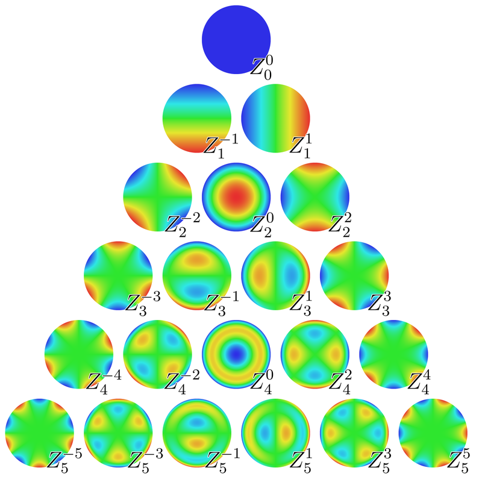

# Zernike-Moments
Implementation of the Zernike's Moments, which are image descriptors

* The first 21 Zernike polynomials, ordered vertically by radial degree and horizontally by azimuthal degree

